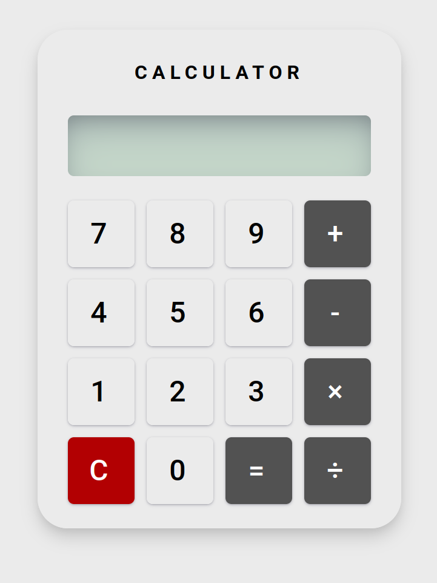

# HTML CSS NAVBAR

This project demonstrate the implementation of CSS Grid to make calculator UI.

## Preview Project


## Reference
<br>
[Reference link](https://i.pinimg.com/736x/a3/67/5b/a3675b36a8eda6dc000324332f6d5739.jpg)
## How to run this project
### Requirement
- Node JS
### Download and installation

1. Clone the repository
```sh
git clone https://github.com/yasirmaxstyle/fgo24-css-calculator.git
```
2. Install `npm`
```sh
npm install -y
```
3. Install `live-server` to run the project in `dev` dependencies
```sh
npm install -D live-server
```
4. Add script `dev` in `package.json` with value `live-server`
```c
"scripts": {
    "dev": "live-server"
}
```
5. Run the project
```sh
npm run dev
```
## How to take part in this project
You are free to fork this project, make improvement and submit a pull request to improve this project. If you find this useful or if you have suggestion, you can start discussing through my social media below.
- [Instagram](https://www.instagram.com/yasirmaxstyle/)
- [LinkedIn](https://www.linkedin.com/in/muhamad-yasir-806230117/)
## Third-party dependencies
- [live-server](https://github.com/tapio/live-server)
## License
This project is under MIT License